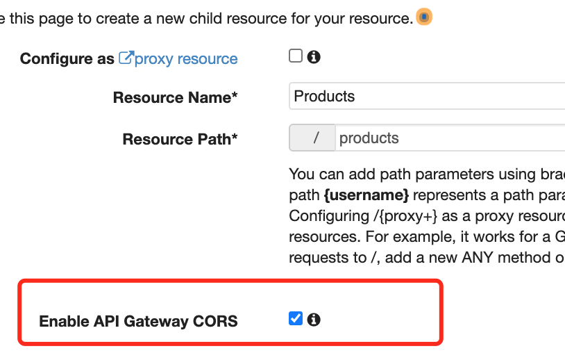

## source code


[Starter code for 'Create a Serverlesss App' tutorial:](https://github.com/jspruance/hexal-serverless-starter)

[Completed code for 'Create a Serverlesss App' tutorial](https://github.com/jspruance/hexal-serverless-starter-complete)


##  Download and install the UI

```bash
git clone https://github.com/jspruance/hexal-serverless-starter.git
### install packages in configuration file 
npm i 
npm start 

```


## Create DynamoDB table


## Create Lambda basic execution role

### ARN

arn:aws:dynamodb:us-east-2:825295840983:table/Products

### Policy

#### 1. AWSLambdaBasicExecutionRole

```jason
{
    "Version": "2012-10-17",
    "Statement": [
        {
            "Effect": "Allow",
            "Action": [
                "logs:CreateLogGroup",
                "logs:CreateLogStream",
                "logs:PutLogEvents"
            ],
            "Resource": "*"
        }
    ]
}

```

#### 2. add inline policy


 click `Add ARN`


copy ARN of table and paste 


## Create Lambda functions

### source code

[ Hexal laambda functions](https://github.com/jspruance/hexal-serverless-starter-complete)


### hexalPut


hexalPut.js

```js
'use strict'
const AWS = require('aws-sdk')

exports.handler = async (event) => {
    // TODO implement
    const doucumentClient = new AWS.DynamoDB.DocumentClient();
    let responseBody = "";
    let statusCode = 0;
    
    const params = {
        TableName: "Products",
        Item: {
            id: '12345',
            productname: 'Solar panels'
        }
    }
    
    try {
        // put data into dynamoDB 
        const data = await doucumentClient.put(params).promise();
        responseBody = JSON.stringify(data);
        statusCode = 200;
        
    } catch(err){
        responseBody = `Unable to put product: ${err}`;
        statusCode = 403;
    }
    
    const response = {
        statusCode: statusCode,
        headers: {
            "Content-Type": "application/json"
        },
        body:responseBody
    };
    
    return response;
    
};

```

### hexalDelete.js

```js
'use strict'
const AWS = require('aws-sdk')

exports.handler = async (event) => {
    // TODO implement
    const doucumentClient = new AWS.DynamoDB.DocumentClient();
    let responseBody = "";
    let statusCode = 0;

    const params = {
        TableName: "Products",
        Key: {
            id: '12345',
        }
    }

    try {
        // put data into dynamoDB
        const data = await doucumentClient.delete(params).promise();
        responseBody = JSON.stringify(data);
        statusCode = 204;

    } catch(err){
        responseBody = `Unable to delete product: ${err}`;
        statusCode = 403;
    }

    const response = {
        statusCode: statusCode,
        headers: {
            "Content-Type": "application/json"
        },
        body:responseBody
    };

    return response;

};

```


### hexalGetItems.js

```js
'use strict'
const AWS = require('aws-sdk')

exports.handler = async (event) => {
    // TODO implement
    const doucumentClient = new AWS.DynamoDB.DocumentClient();
    let responseBody = "";
    let statusCode = 0;

    const params = {
        TableName: "Products"
    }

    try {
        // put data into dynamoDB
        const data = await doucumentClient.scan(params).promise();
        responseBody = JSON.stringify(data.Items);
        statusCode = 200;

    } catch(err){
        responseBody = `Unable to get product: ${err}`;
        statusCode = 403;
    }

    const response = {
        statusCode: statusCode,
        headers: {
            "Content-Type": "application/json"
        },
        body:responseBody
    };

    return response;

};

```


### hexalUpdateItems.js

```js
'use strict'
const AWS = require('aws-sdk')

exports.handler = async (event) => {
    // TODO implement
    const doucumentClient = new AWS.DynamoDB.DocumentClient();
    let responseBody = "";
    let statusCode = 0;

    const params = {
        TableName: "Products",
        Key: {
            id: '12345'
        },
        UpdateExpression: "set productname = :n",
        ExpressionAttributeValues: {
          ":n": " water pumps"
        },
        ReturnValues: "UPDATED_NEW"
        }

    try {
        // put data into dynamoDB
        const data = await doucumentClient.update(params).promise();
        responseBody = JSON.stringify(data);
        statusCode = 204;

    } catch(err){
        responseBody = `Unable to update product: ${err}`;
        statusCode = 403;
    }

    const response = {
        statusCode: statusCode,
        headers: {
            "Content-Type": "application/json"
        },
        body:responseBody
    };

    return response;

};

```


## Create REST API GateWay

#### create api


#### create resource





#### create id 


### source code

[lambda function code](https://github.com/jspruance/hexal-lambda-functions)

### put  (POST method)


#### add  HTTP request headers


#### create a model

[models and mapping templates](https://docs.aws.amazon.com/apigateway/latest/developerguide/models-mappings.html)

[How do I associate a model with my API in API Gateway?](https://aws.amazon.com/premiumsupport/knowledge-center/model-api-gateway/)


```json
{
  "$schema": "http://json-schema.org/draft-04/schema#",
    "title": "ProductsInputModel",
    "type": "object",
    "properties": {
        "id": {
            "type": "string"
        },
        "productname": {
            "type": "string"
        }
    }
}
```


#### update code


```js
'use strict';
const AWS = require('aws-sdk');

exports.handler = async (event, context) => {
  const documentClient = new AWS.DynamoDB.DocumentClient();

  let responseBody = "";
  let statusCode = 0;

  const { id, productname } = JSON.parse(event.body);

  const params = {
    TableName: "Products",
    Item: {
      id: id,
      productname: productname
    }
  };

  try {
    const data = await documentClient.put(params).promise();
    responseBody = JSON.stringify(data);
    statusCode = 201;
  } catch(err) {
    responseBody = `Unable to put product: ${err}`;
    statusCode = 403;
  }

  const response = {
    statusCode: statusCode,
    headers: {
      "Content-Type": "application/json"
    },
    body: responseBody
  };

  return response;
};

```

#### test


### delete

#### create delete 


#### edit method request


#### update code

```json
'use strict';
const AWS = require('aws-sdk');

exports.handler = async (event, context) => {
  const documentClient = new AWS.DynamoDB.DocumentClient();

  let responseBody = "";
  let statusCode = 0;

  const { id } = event.pathParameters;

  const params = {
    TableName: "Products",
    Key: {
      id: id
    }
  };

  try {
    const data = await documentClient.delete(params).promise();
    responseBody = JSON.stringify(data);
    statusCode = 204;
  } catch(err) {
    responseBody = `Unable to delete product: ${err}`;
    statusCode = 403;
  }

  const response = {
    statusCode: statusCode,
    headers: {
      "Content-Type": "application/json"
    },
    body: responseBody
  };

  return response;
};
```


#### test


### getAll

#### create a method


### update

#### create patch method 


#### update method request


#### update code

```js
'use strict';
const AWS = require('aws-sdk');

exports.handler = async (event, context) => {
  const documentClient = new AWS.DynamoDB.DocumentClient();

  let responseBody = "";
  let statusCode = 0;

  const { id, productname } = JSON.parse(event.body);

  const params = {
    TableName: "Products",
    Key: {
      id: id
    },
    UpdateExpression: "set productname = :n",
    ExpressionAttributeValues: {
      ":n": productname
    },
    ReturnValues: "UPDATED_NEW"
  };

  try {
    const data = await documentClient.update(params).promise();
    responseBody = JSON.stringify(data);
    statusCode = 204;
  } catch(err) {
    responseBody = `Unable to update product: ${err}`;
    statusCode = 403;
  }

  const response = {
    statusCode: statusCode,
    headers: {
      "Content-Type": "application/json"
    },
    body: responseBody
  };

  return response;
};
```


#### test


## Integrate REST APT with UI

### source code

[complete code](https://github.com/jspruance/hexal-serverless-starter-complete/tree/master/src/components)

### Enable CORS

add 'Access-Control-Allow-Origin': '*' to headers 

```json
"Access-Control-Allow-Origin": "*"
```

### deploy 


### update src/confi.json

```json
{
  "api": { 
    "invokeUrl": "https://vgp03n7qf9.execute-api.us-east-2.amazonaws.com/prod"
  } 
}
```


### getAll 

#### update components/Products.js

update fetchProducts

```json
fetchProducts = async () => {
    // add call to AWS API Gateway to fetch products here
    // then set them in state
    try {
      const res = await axios.get(`${config.api.invokeUrl}/products`);
      const products = res.data;
      this.setState({ products: products });
    } catch (err) {
      console.log(`An error has occurred: ${err}`);
    }
  }
```


#### update ProductAdmin.js

update fetchProducts

```json
  fetchProducts = async () => {
    // add call to AWS API Gateway to fetch products here
    // then set them in state
    try {
      const res = await axios.get(`${config.api.invokeUrl}/products`);
      const products = res.data;
      this.setState({ products: products });
    } catch (err) {
      console.log(`An error has occurred: ${err}`);
    }
  }
```


### post

#### update ProductAdmin.js

update handleAddProduct

```js
handleAddProduct = async (id, event) => {
    event.preventDefault();
    // add call to AWS API Gateway add product endpoint here
    try {
      const params = {
        "id": id,
        "productname": this.state.newproduct.productname
      };
      await axios.post(`${config.api.invokeUrl}/products/${id}`, params);
      this.setState({ products: [...this.state.products, this.state.newproduct] });
      this.setState({ newproduct: { "productname": "", "id": "" }});
    }catch (err) {
      console.log(`An error has occurred: ${err}`);
    }
  }
```


### delete

### update ProductAdmin.js

update handleDeleteProduct

```js
handleDeleteProduct = async (id, event) => {
    event.preventDefault();
    // add call to AWS API Gateway delete product endpoint here
    try {
      await axios.delete(`${config.api.invokeUrl}/products/${id}`);
      const updatedProducts = [...this.state.products].filter(product => product.id !== id);
      this.setState({products: updatedProducts});
    }catch (err) {
      console.log(`Unable to delete product: ${err}`);
    }
  }
```


### update

#### update ProductAdmin.js

update handleUpdateProduct

```js
handleUpdateProduct = async (id, name) => {
    // add call to AWS API Gateway update product endpoint here
    try {
      const params = {
        "id": id,
        "productname": name
      };
      await axios.patch(`${config.api.invokeUrl}/products/${id}`, params);
      const productToUpdate = [...this.state.products].find(product => product.id === id);
      const updatedProducts = [...this.state.products].filter(product => product.id !== id);
      productToUpdate.productname = name;
      updatedProducts.push(productToUpdate);
      this.setState({products: updatedProducts});
    }catch (err) {
      console.log(`Error updating product: ${err}`);
    }
  }
```


## Veriy functionality

